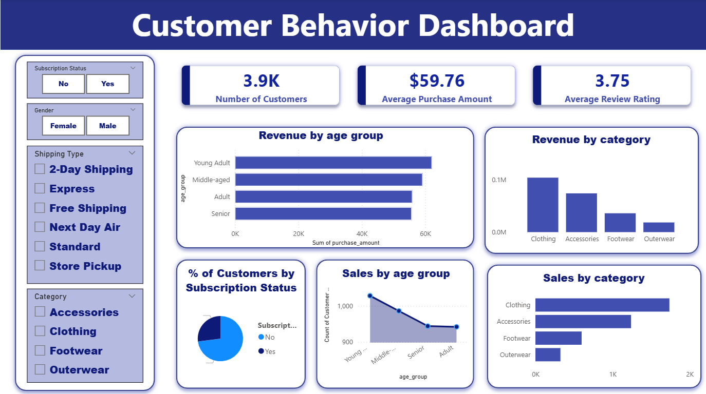

# 🛍️ Customer Shopping Behavior Analysis

## 📌 Overview

This end-to-end Data Analytics project analyzes customer shopping behavior to uncover purchasing trends, customer segments, subscription patterns, and product performance.

Using **Python, PostgreSQL, SQL, and Power BI**, I transformed raw retail transaction data into actionable business insights through data cleaning, analysis, and interactive dashboard development.

## 🛠️ Tech Stack

* Python (Pandas, NumPy)
* PostgreSQL
* SQL
* Power BI
* Microsoft Excel

## 📊 Dashboard

## 🔍 Key Insights

* Young Adults and Middle-Aged customers generated the highest revenue.
* Clothing was the top-performing product category.
* Subscribers spent significantly more than non-subscribers.
* Over 70% of customers were non-subscribers, indicating strong growth potential.

## 💡 Recommendations

* Target subscription offers after a customer's second purchase.
* Bundle Clothing and Accessories to increase average order value.
* Focus marketing campaigns on high-value customer segments.
* Optimize inventory based on category demand.

## 🚀 Skills Demonstrated

* Data Cleaning
* Exploratory Data Analysis (EDA)
* SQL Querying
* PostgreSQL
* Data Visualization
* Business Intelligence
* Dashboard Design

## 👤 Author

**Riddhika Zolage**

GitHub: https://github.com/riddhikazolage

